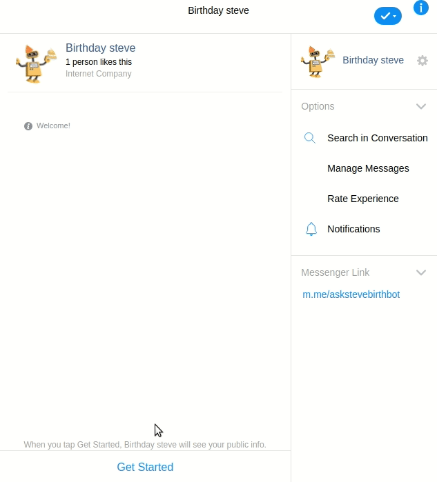

# Facebook Birthday chat bot


Birthday chat bot using Node.js, Express, redis, docker and MongoDB.



## Goal

The goal is to create a ```Facebook Messenger``` bot in Node.js. The app should:
- Be able to set up a Messenger webhook
- When a user starts a conversation, ask few questions:
1. User's first name
2. Birth date
3. If the user wants to know how many days till his next birtday. This is a yes/no answer
and the bot should accept both user text answer („yes", „yeah", „yup”, "no”, "nah", etc.)
and quick reply buttons. To make it simpler, you can assume there's only one valid
date format: YYYY-MM-DD
- if user says yes to the last question, send him a message: ```There are <N> days left until your next birthday```
- if user says no, just say: Goodbye
- Within the same app, create a REST endpoint ```/messages``` that lists all messages received
from users
- Create a REST endpoint for viewing a single message by its ID and also for deleting a
single message.

## Features

 - [Docker](https://www.docker.com/) support
 - [Redis](https://redis.io/) using redis for track flow of questions
 - CORS enabled
 - Uses [yarn](https://yarnpkg.com)
 - Express + MongoDB ([Mongoose](http://mongoosejs.com/))
 - Consistent coding styles with [editorconfig](http://editorconfig.org)
 - Uses [helmet](https://github.com/helmetjs/helmet) to set some HTTP headers for security
 - Load environment variables from .env files with [dotenv](https://github.com/rolodato/dotenv-safe)
 - Request validation with [joi](https://github.com/hapijs/joi)
 - Gzip compression with [compression](https://github.com/expressjs/compression)
 - Linting with [eslint](http://eslint.org)
 - Tests with [mocha](https://mochajs.org), [chai](http://chaijs.com) and [sinon](http://sinonjs.org)
 - Code coverage with [istanbul](https://istanbul.js.org) and [coveralls](https://coveralls.io)
 - Git hooks with [husky](https://github.com/typicode/husky) 
 - Logging with [morgan](https://github.com/expressjs/morgan)
 - API documentation generation with [swagger](https://swagger.io)
 - Monitoring with [pm2](https://github.com/Unitech/pm2)

## Requirements

 - [Node v7.6+](https://nodejs.org/en/download/current/) or [Docker](https://www.docker.com/)
 - [Yarn](https://yarnpkg.com/en/docs/install)

## Getting Started

Clone the repo and make it yours:

```bash
git clone git@github.com:miladr0/steve-chat-bot.git
cd steve-chat-bot

```

Install dependencies:

```bash
yarn
```

Set environment variables:

```bash
cp .env.example .env
```

## Running Locally
- To start the server:
```bash
yarn dev
```

## Running in Docker

- To start the server:
```bash
yarn docker:dev
```
## Setup webhook
From facebook developer panel set blew url as Callback URL of webhook. more info about the documentation of urls and apis. [Swagger generated document](#Documents) .
 ```bash
[GET] http://localhost:3000/v1/bots/webhook
 ```
## Lint

```bash
# lint code with ESLint
yarn lint

# try to fix ESLint errors
yarn lint:fix

# lint and watch for changes
yarn lint:watch
```

## Test

```bash
# run all tests with Mocha
yarn test

# run integration tests
yarn test:integration
```

## Validate

```bash
# run lint and tests
yarn validate
```

## Documents
available at:
 ```bash
[GET] http://localhost:3000/api-docs
 ```
 
